# SPL-3 — SpecTwin

Software Project Lab 3, IIT, University of Dhaka.

**SpecTwin** is a free, multi-tenant platform that turns a plain-language description of a system into a
**reviewed Software Requirements Specification (SRS)** and a **UML class diagram**. A person reviews and approves
every intermediate artifact, so nothing reaches the final document without being checked.

The same pipeline can be driven by four interchangeable engines (a deterministic rule engine, a local Ollama model,
a hosted AI model, or the user's own AI provider key), and a correction memory lets the AI engines learn from the
fixes users make.

---

## Table of contents

1. [What it does](#1-what-it-does)
2. [System architecture](#2-system-architecture)
3. [The generation pipeline](#3-the-generation-pipeline)
4. [Stage lifecycle: review, approve, reopen](#4-stage-lifecycle-review-approve-reopen)
5. [Generation engines](#5-generation-engines)
6. [Rule-based engine in detail](#6-rule-based-engine-in-detail)
7. [Local AI (Ollama) engine in detail](#7-local-ai-ollama-engine-in-detail)
8. [Hosted and BYOK engines](#8-hosted-and-byok-engines)
9. [Correction memory (RAG)](#9-correction-memory-rag)
10. [Publishing: SRS document and class diagram](#10-publishing-srs-document-and-class-diagram)
11. [Class Modeler](#11-class-modeler)
12. [One class model, three editors](#12-one-class-model-three-editors)
13. [Workspaces, invitations and email](#13-workspaces-invitations-and-email)
14. [Data model](#14-data-model)
15. [API overview](#15-api-overview)
16. [Repository layout](#16-repository-layout)
17. [Running the project](#17-running-the-project)
18. [Configuration](#18-configuration)
19. [Verification](#19-verification)

---

## 1. What it does

| Input | Output |
| --- | --- |
| A free-text description such as *"A library has many books. A member can borrow up to five books. The librarian approves each loan…"* | An IEEE-style SRS document (Markdown, with a traceability matrix), a validated UML class model, and an editable draw.io class diagram saved to the project |

Main features:

- **Six-stage reviewed pipeline**: input → clarifications → final story → requirements → class model → draw.io XML.
- **Four engines**: Rule-Based, Local AI (Ollama), AI generation (hosted), and Your AI provider (BYOK).
- **Clarification questions** for missing actors, vague metrics, pronoun references, conflicting rules and so on.
- **Versioned stages**: every edit creates a new revision; reopening a stage marks everything after it as stale.
- **Class Modeler**: a standalone noun/verb (Abbott) analysis that turns a short OOP task into a class diagram and
  explains every decision.
- **Correction memory (RAG)**: fixes users make to AI output are fed back into later prompts.
- **SRS comparison**: put two published SRS documents side by side and see which requirements were added, removed
  or changed, plus a line-by-line diff of the text.
- **Multi-tenant workspaces** with member roles, projects, workspace search and a platform admin console.
- **Email invitations**: organization owners and admins invite people by email; the invitee joins with their
  existing account or registers from the link.
- **Email delivery** for verification codes and invitations through Resend or SMTP (or printed to the console in
  development).
- **Free to use**: no engine bills the user.

---

## 2. System architecture

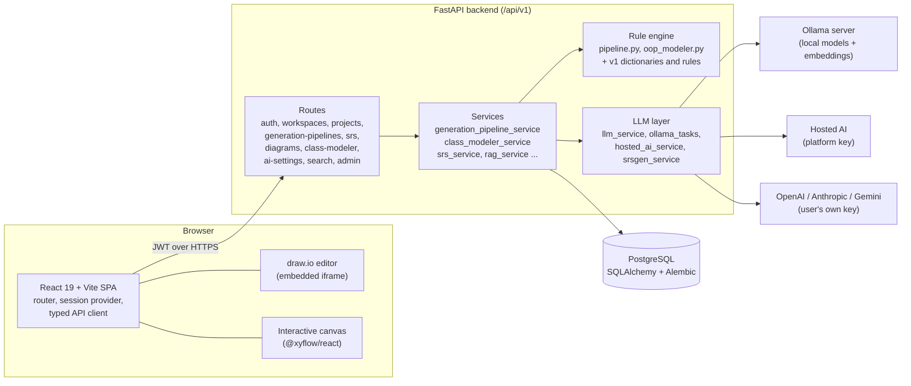

- **Tenancy**: every product API is scoped by `workspace_id` and checked against workspace membership
  (`owner`, `admin`, `member`, …). Platform administration is separate under `/api/v1/admin` and requires
  `users.platform_role = super_admin`.
- **Auditability**: every model call is stored in `llm_calls` with its prompt template, so admins can see exactly
  what was sent and returned.

---

## 3. The generation pipeline

A pipeline run moves through six fixed stages (`PIPELINE_STAGES` in
`backend/app/services/generation_pipeline_service.py`). Each stage produces a JSON artifact that the user can edit,
then approves before the next one is generated.

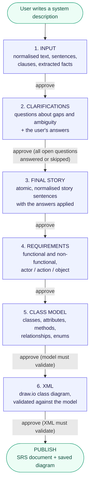

### What each stage contains

| # | Stage | Payload (main keys) | Approval gate |
| --- | --- | --- | --- |
| 1 | `input` | `normalization.rawText`, `normalizedText`, `sentences`, `clauses`, `facts` | `rawText` must be present |
| 2 | `clarifications` | `facts`, `sentences`, `clarificationQuestions[]`, `answers[]` | Every **open** question answered, skipped, or marked not applicable |
| 3 | `final-story` | `atomicStorySections[]`, `normalizedSentences`, `appliedClarificationAnswers`, `unresolvedFields`, `warnings` | Must contain `atomicStorySections` |
| 4 | `requirements` | `requirements[]` each with `requirementId`, `requirementType` (`functional` / `non_functional`), `statement`, `actor`, `action`, `object`, `enabled` | Must contain `requirements` |
| 5 | `class-model` | `classes[]`, `relationships[]`, `enums[]`, `constraints[]` | `validate_class_model` must pass (valid types, directions, multiplicities, no dangling ends) |
| 6 | `xml` | `xml`, `validation`, `classModel`, `classModelVersion` | `validate_drawio_xml` must pass against the class model |

Clarification question categories: **Missing Actor, Missing Object, Missing Action, Unknown Action, Vague Metric,
Vague Timing, Ambiguous Quantity, Pronoun Reference, Conflicting Rule**. Each question quotes the source sentence
that triggered it and names the fact slot its answer will fill.

### End-to-end request flow

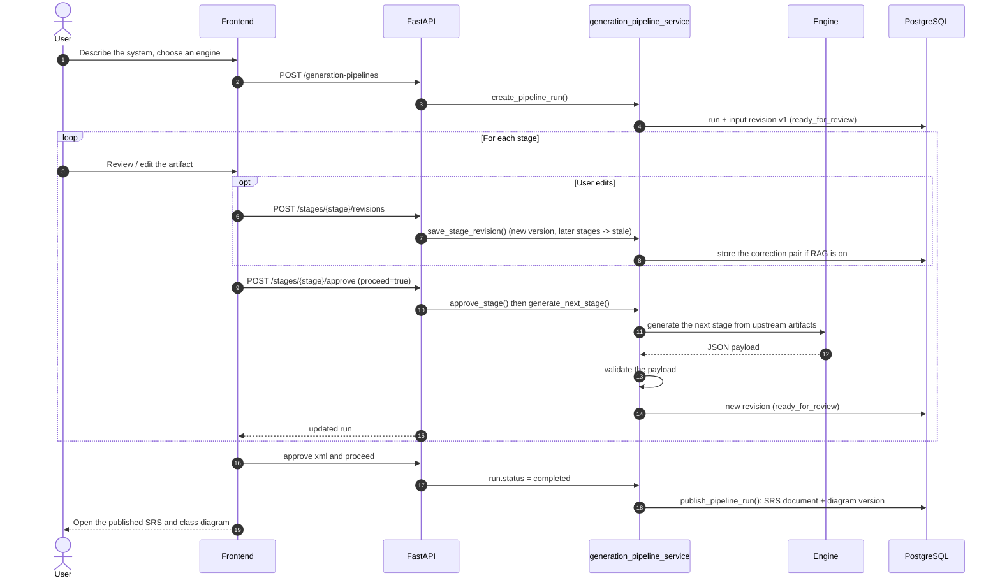

---

## 4. Stage lifecycle: review, approve, reopen

Stages are never overwritten. Every generation or edit creates a new **revision** with an incremented
`version_number` and a link to its parent revision, so the full history of a run is kept.

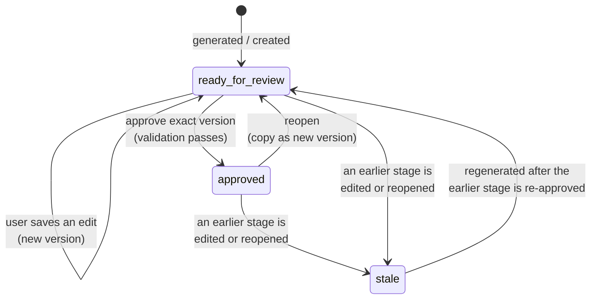

Rules enforced by the service:

- **Optimistic concurrency** — saves and approvals carry the version the user loaded; if someone else changed the
  stage in the meantime, the request is rejected with *"reload before saving"*.
- **Only the current stage can be approved**, and only its exact latest version.
- **Editing or reopening a stage marks every later stage `stale`**, because those were built from the old version.
- **Re-approving after a reopen refreshes the same SRS document** instead of creating a duplicate.
- Run status moves through `ready_for_review → approved → running → … → completed`, or `failed` if a generation
  throws.

---

## 5. Generation engines

The engine is chosen when a run is created (`generation_mode`) and decides who writes stages 2–5. Stage 6 (draw.io
XML) is always rendered and validated by the rule engine, because it is a mechanical transformation of the approved
class model.

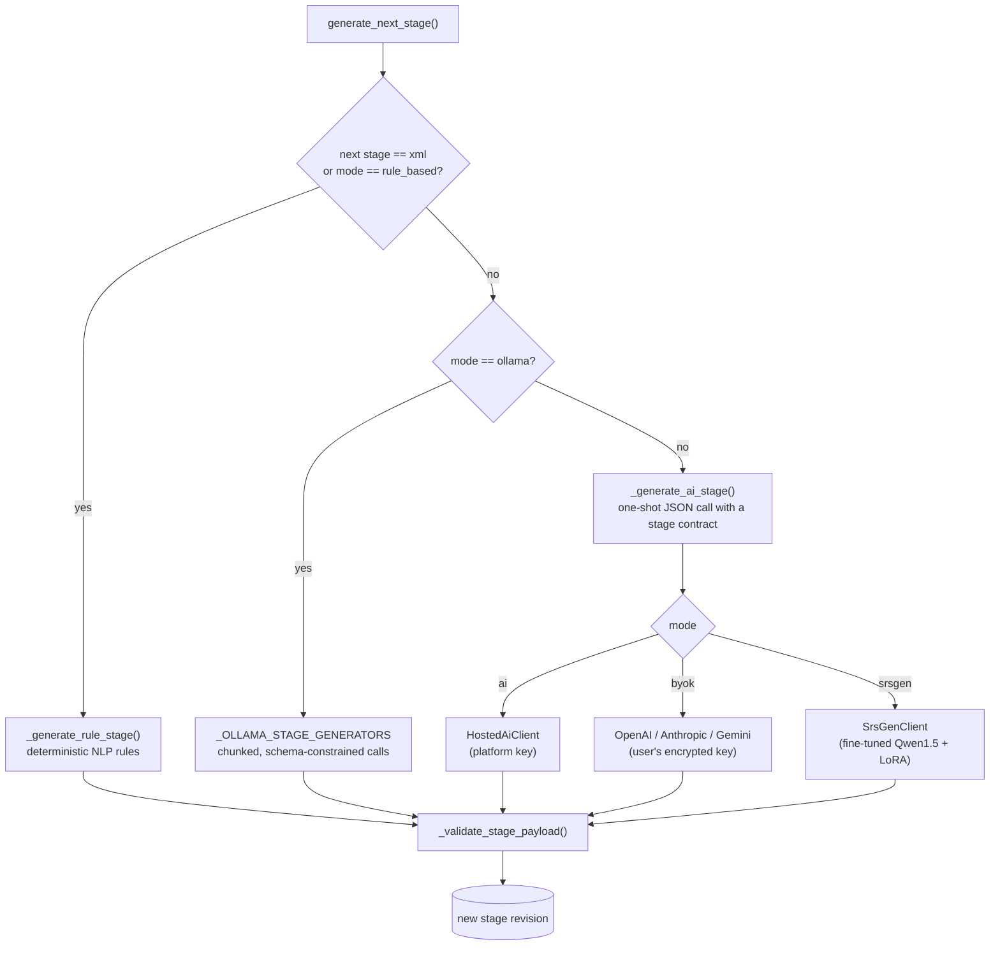

| Engine | `generation_mode` | Who writes the content | Needs | Learns from corrections |
| --- | --- | --- | --- | --- |
| **Rule-Based** | `rule_based` | Deterministic NLP rules + v1 dictionaries | Nothing; offline, explainable | No (deterministic) |
| **Local AI (Ollama)** | `ollama` | An open model on the user's own machine | A running Ollama server | Yes |
| **AI generation** | `ai` | A hosted model on one platform-managed key | `OPENROUTER_API_KEY` on the server; hidden in the UI when unset | Yes |
| **Your AI provider** | `byok` | OpenAI, Anthropic or Gemini on the user's own key | Key added under *Settings → AI providers* (encrypted at rest) | Yes |
| SrsGen (experimental) | `srsgen` | Fine-tuned Qwen1.5-1.8B with a LoRA adapter (`backend/model_artifacts/srsgen-qwen1.5`) | Local model artifacts | Yes |

The hosted engine never exposes the upstream vendor or its model IDs; the API and UI only ever say
*"AI generation"*, and the model name is not recorded on the run or in the published document.

---

## 6. Rule-based engine in detail

`backend/app/rule_engine/pipeline.py` is a fully offline NLP pipeline driven by JSON dictionaries
(`backend/app/dictionaries/v1/*.json`: action aliases, actor hints, modals, NFR keywords, relationship phrases,
stop words, quantifiers, temporal markers …) and rules (`backend/app/rules/v1/rules.json`). Every output is stamped
with `dictionaryVersionId` and `ruleVersionId`, so results are reproducible.

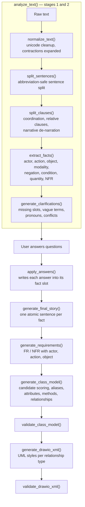

Key ideas:

- **Facts** are the core unit: each one records *who* (actor) does *what* (action) to *what* (object), plus
  modality (`shall` / `may` / `must not`), conditions (`if`, `when`, `unless` …), quantities and NFR metrics, with a
  pointer back to its source sentence.
- **Class candidates are scored**: actors and objects of facts gain points, relationship facts add more, and
  candidates above a threshold become classes. Synonyms are merged through a class alias map, and attribute-like
  nouns become attributes instead of classes.
- **Relationships** use the six UML types (`association`, `aggregation`, `composition`, `dependency`,
  `inheritance`, `realization`); associations carry a direction, and multiplicities (`1`, `0..*`, `1..5` …) are only
  allowed on association, aggregation and composition.

---

## 7. Local AI (Ollama) engine in detail

Ollama mode is **LLM-authored end to end**: the rule engine's sentence/fact extraction never runs, so nothing
silently falls back to a rule-engine reading of the text. It is tuned for small models on CPU-only laptops
(`backend/app/services/ollama_tasks.py`).

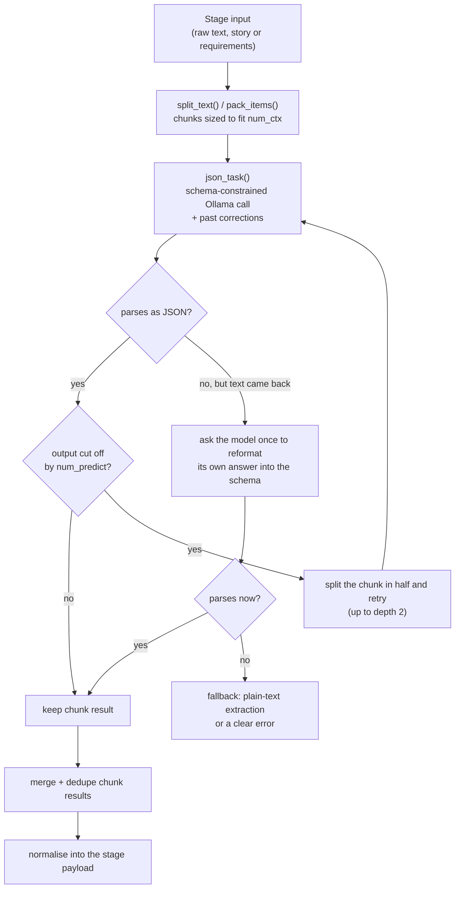

Per stage:

| Stage | What the model does |
| --- | --- |
| Clarifications | Reads the raw text, asks up to 12 questions, then **drafts an answer** to each for the user to review |
| Final story | Rewrites the text chunk by chunk into atomic sentences, using the answered questions |
| Requirements | Turns batches of story sentences into FR/NFR requirements |
| Class model | **Two passes**: classes first (each chunk is told the class names found so far, so names stay consistent), then relationships constrained by a JSON schema to exactly those class names |

The model is pre-loaded while the user reviews the input stage, so the first generation does not also pay the model
load time.

---

## 8. Hosted and BYOK engines

`_generate_ai_stage()` sends one JSON request per stage:

- A **stage contract** (`_stage_contract`) spells out the exact keys and allowed values the stage must return.
- The **upstream** payload contains the title, raw text, the previous stage's artifact, the facts with
  clarification answers applied (for requirements and class model), and any **past corrections**.
- The prompt marks the upstream JSON as untrusted product data, so instructions hidden inside a user's text are
  not followed.
- If the reply is not valid JSON, a tolerant parser repairs it; failing that, a plain-text fallback builds a
  minimal payload, which is then validated like any other.

BYOK credentials are encrypted at rest (`credential_crypto.py`), can be tested from Settings, and are marked as used
on every call.

---

## 9. Correction memory (RAG)

When `RAG_ENABLED=true`, every fix a user makes to AI-authored output is remembered and shown to the model the next
time it sees similar input. It works for every model-authored engine (`ollama`, `ai`, `byok`, `srsgen`) and in the
Class Modeler; the deterministic rule engine is excluded because it has nothing to learn.

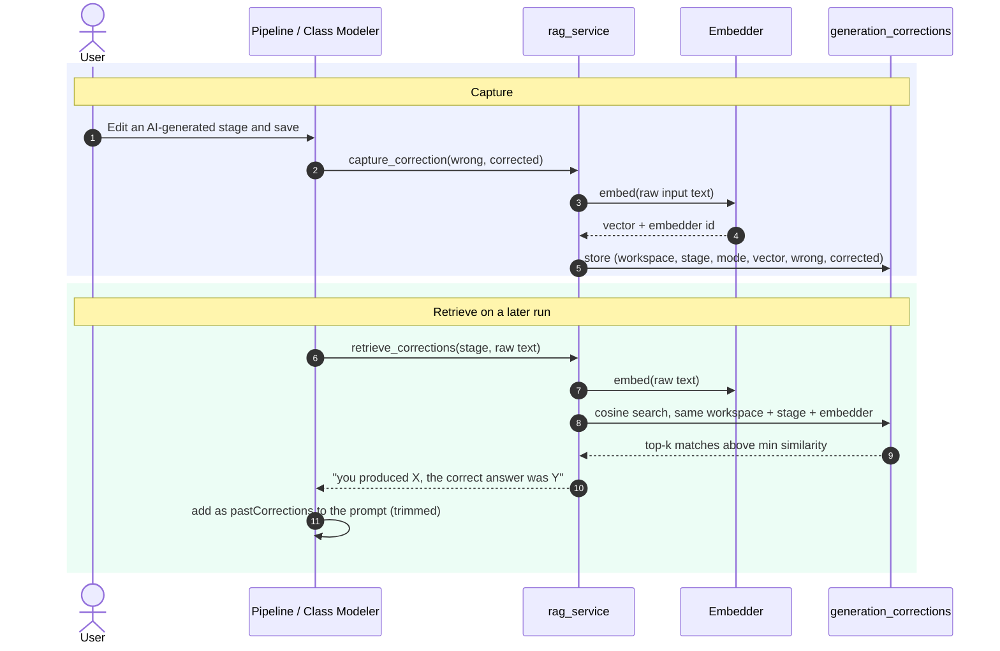

- **Embedders**: Ollama's embedding model (`OLLAMA_EMBED_MODEL`, default `nomic-embed-text`) when available,
  otherwise a built-in **lexical embedder** (hashed unigrams + bigrams, L2-normalised) that needs no service.
  `RAG_EMBEDDER=auto|ollama|lexical` chooses. Rows record which embedder wrote them, and searches only compare like
  with like.
- **Storage**: corrections persist in the `generation_corrections` table; similarity search runs over an in-memory
  index built from it, so no pgvector or external vector DB is needed.
- **Budget**: at most `RAG_TOP_K` matches above `RAG_MIN_SIMILARITY`, each trimmed so it never crowds the task out
  of the context window.
- **Safety**: RAG failures are logged and skipped; they never break a generation.

---

## 10. Publishing: SRS document and class diagram

Approving the `xml` stage and proceeding completes the run and calls `publish_pipeline_run()`
(`backend/app/services/srs_service.py`):

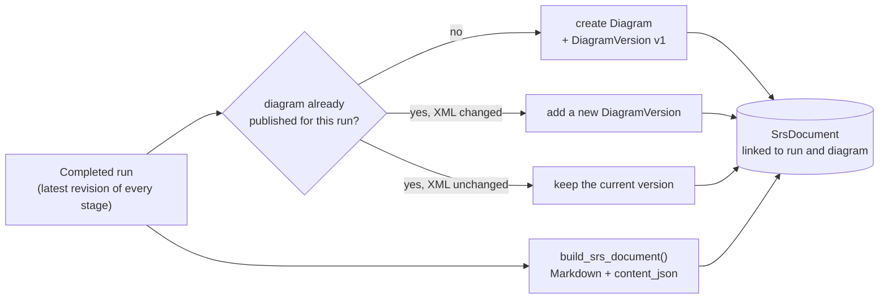

The generated SRS (`srs_document_builder.py`) is IEEE-style:

1. **Introduction** — purpose, scope, source description, engine used.
2. **Overall Description** — user classes and clarifications.
3. **Specific Requirements** — functional and non-functional requirements.
4. **Domain Model** — exactly what the Class Modeler's *Classes* tab shows: each class with its attributes,
   operations and what it inherits or implements, every relationship written out in plain words
   (e.g. *"Each Member borrows zero to five Books"*), and the enumerations.
- **Appendix A — Traceability matrix** linking requirements to classes.
- **Appendix B — Class diagram** reference.

Documents can be viewed, edited, exported and archived; diagrams keep every version and can be exported as draw.io
XML.

### Comparing SRS documents

**SRS documents → Compare** (`#/documents/compare?a=<id>&b=<id>`, also in a document's actions menu) puts two
published documents side by side, for example two runs over the same description or a document before and after
an edit:

- **Requirements** tab: requirements are matched by identical statement first (so renumbering does not count as a
  change), then by requirement ID. Each one is marked *added*, *removed*, *changed* or *unchanged*.
- **Full text** tab: a line-by-line diff of the Markdown, with long unchanged stretches collapsed.

The comparison runs in the browser (`frontend/src/features/srs/documentDiff.ts`); no extra API is needed.

---

## 11. Class Modeler

A standalone tool (`/class-modeler`) for OOP-course style tasks: paste a short requirement text and get a UML class
model plus a draw.io diagram, without running the full pipeline. Three engines share one response shape so results
can be compared side by side.

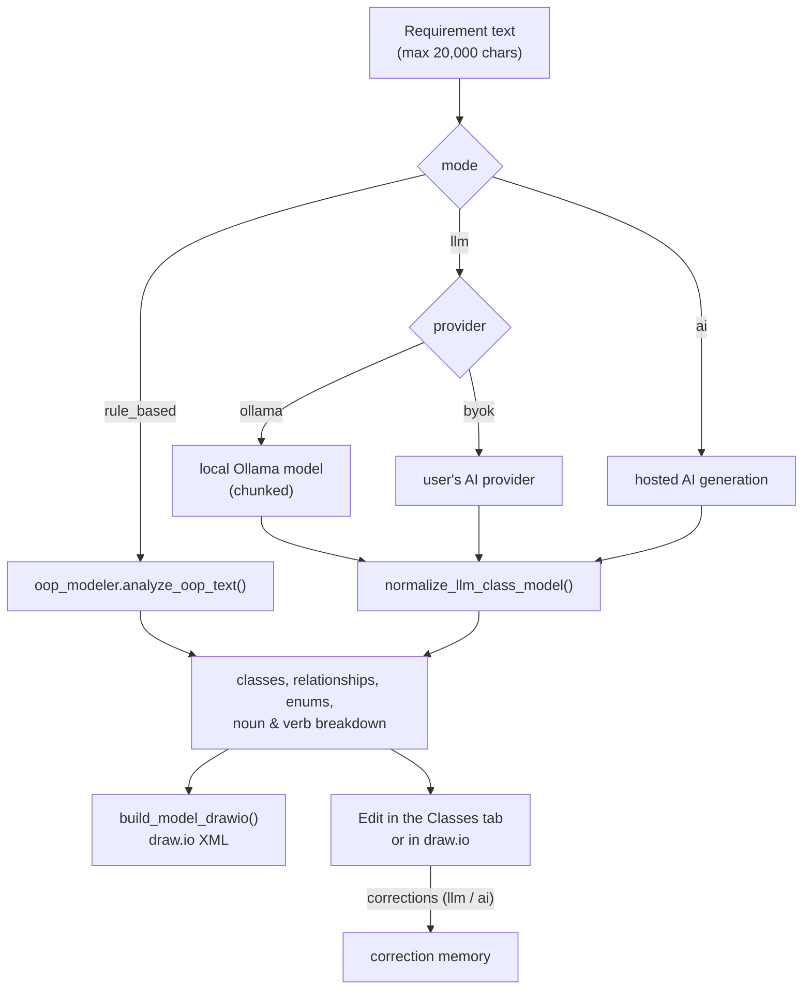

The rule-based modeler applies Abbott's textual analysis the way a student would, and records every decision so the
reasoning can be shown step by step:

1. Classify each sentence (generalisation, possible states, "has" list, association, behaviour).
2. Collect every noun as a candidate, with its evidence.
3. Decide per candidate: **class**, **attribute** of some class, or **rejected** (system boundary, generic word,
   value with no structure or behaviour).
4. Merge synonyms (*"library member"* = *"member"*).
5. Turn verbs into methods on the class that performs them, with a typed parameter for the object they act on.
6. Draw relationships: inheritance, composition/aggregation for "has/contains", associations for verbs, with
   multiplicities read from quantifiers.
7. Pull attributes shared by every subclass up into the parent.

---

## 12. One class model, three editors

A class model has one representation and three views that stay in step:

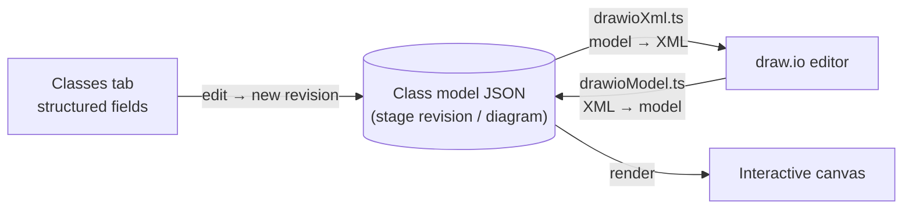

- The **Classes** tab edits classes, attributes, methods and relationships as structured fields
  (each change is a new class-model revision through the `/class-model/classes` and `/class-model/relationships`
  endpoints).
- The **draw.io** tab edits the model as a diagram; changes are read back into the model.
- The **canvas** reads its model straight out of the stored draw.io XML
  (`frontend/src/features/diagram/drawioModel.ts`), so every view shows the same drawing, including unsaved edits and
  older versions being previewed.

---

## 13. Workspaces, invitations and email

Every user gets a **personal workspace** at registration and can create **organization workspaces** for a team.
Everything (projects, runs, documents, diagrams) belongs to one workspace, and access is checked against the
member's role:

| Role | Can |
| --- | --- |
| Owner | everything, including managing members; cannot be removed |
| Admin | manage members and invitations, and all content |
| Member | create and edit projects, runs, documents and diagrams |
| Viewer | read only |

### Inviting people

Owners and admins invite people from **Members** by email and role. The invitee does not need an account yet:

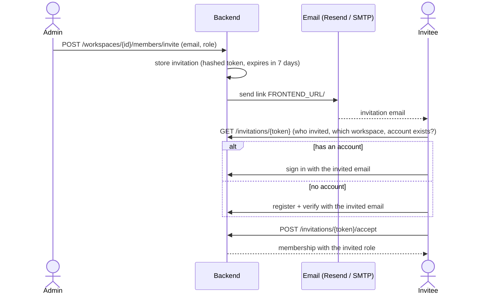

- A link works **once**, only for the **invited email**, and **expires** after `WORKSPACE_INVITATION_EXPIRE_DAYS`.
- Inviting the same email again refreshes the pending invitation (new role, new link); the old link stops working.
- Pending invitations are listed on the Members page and can be cancelled.
- Only a SHA-256 hash of the token is stored (`workspace_invitations` table).

### Email delivery

Verification codes and invitations go through one delivery path (`backend/app/services/email_service.py`),
selected by `EMAIL_DELIVERY_MODE`:

| Mode | Behaviour |
| --- | --- |
| `console` (default) | Prints the email to the backend log. The API also returns the verification code / invite link so local development works without a mail server. |
| `resend` | Sends through the [Resend](https://resend.com) HTTP API using `RESEND_API_KEY`. |
| `smtp` | Sends through any SMTP server (`SMTP_HOST`, `SMTP_PORT`, `SMTP_USERNAME`, `SMTP_PASSWORD`, …). |

To send real email with Resend, set in `backend/.env`:

```env
EMAIL_DELIVERY_MODE=resend
RESEND_API_KEY=re_xxxxxxxx
RESEND_FROM_EMAIL=no-reply@your-verified-domain.com
RESEND_FROM_NAME=SpecTwin
FRONTEND_URL=https://your-frontend-address
```

`RESEND_FROM_EMAIL` must use a domain verified in Resend (`onboarding@resend.dev` only delivers to the Resend account
owner's own address, which is fine for testing). If sending fails, the API answers `503` and nothing is saved, so the
user can simply try again.

---

## 14. Data model

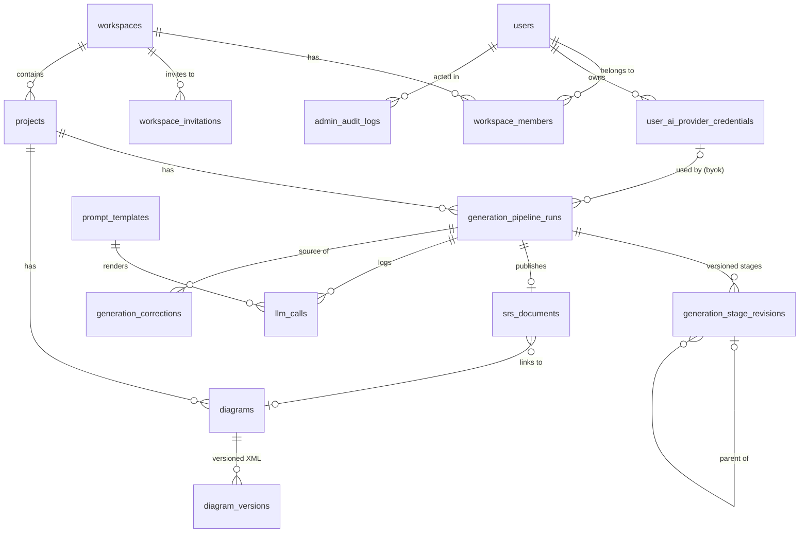

Migrations live in `backend/alembic/versions/` (users → workspaces → projects → diagrams → generation → LLM →
SRS → admin → rule system → generation modes → corrections → free-platform documents → correction memory for all AI
engines → workspace invitations).

---

## 15. API overview

All routes are under `/api/v1`. Interactive docs are served at `/docs` when the backend is running.

| Area | Main endpoints |
| --- | --- |
| Auth | `POST /auth/register`, `/verify-email`, `/login`, `/logout`, `/forgot-password`, `/reset-password`, `GET /auth/me` |
| Workspaces | list / create / get workspaces; list, update and remove members; email invitations (`POST /members/invite`, `GET` / `DELETE /invitations`) |
| Invitations | `GET /invitations/{token}` (public preview), `POST /invitations/{token}/accept` |
| Projects | create, list, get, update, archive |
| Generation pipelines | `POST` create run · `GET` list / get · `PATCH` rename · `DELETE` · `POST /{run_id}/next` · `POST /{run_id}/stages/{stage}/revisions` · `/approve` · `/reopen` |
| Class model edits | `POST/PATCH/DELETE /{run_id}/class-model/classes[/{id}]` and `/relationships[/{id}]` |
| SRS documents | list, get, update, archive, `GET /{id}/export` |
| Diagrams | create, list, get, update, delete, new version, `GET /{id}/versions`, `GET /{id}/export` |
| Class Modeler | `POST /class-modeler/generate`, `POST /class-modeler/corrections`, `GET /class-modeler/ollama-models` |
| AI settings | hosted availability, providers, models per provider, save / test / delete credentials |
| Search | workspace-wide search |
| Admin | users, workspaces, overview, projects, pipeline runs, LLM calls, prompt templates, audit logs, platform settings |
| Health | `GET /health` |

---

## 16. Repository layout

```text
SPL-3/
├── backend/                     FastAPI + SQLAlchemy + Alembic
│   ├── app/
│   │   ├── api/v1/routes/       HTTP routes (one file per area)
│   │   ├── services/            business logic: pipeline, class modeler, SRS, RAG, LLM clients
│   │   ├── rule_engine/         pipeline.py (NLP pipeline), oop_modeler.py (Abbott analysis)
│   │   ├── dictionaries/v1/     JSON dictionaries the rule engine reads
│   │   ├── rules/v1/            rule definitions
│   │   ├── db/models/           SQLAlchemy models
│   │   ├── schemas/             Pydantic request/response models
│   │   └── core/                settings and security
│   ├── alembic/versions/        database migrations
│   ├── model_artifacts/         SrsGen base model + LoRA adapter
│   └── tests/                   unit and integration tests
├── frontend/                    React 19 + Vite + Tailwind 4
│   └── src/
│       ├── api/                 typed API client
│       ├── app/                 shell, router, session, sidebar
│       ├── pages/               one file per screen (Generate, Run, Documents, Diagrams, Admin, …)
│       ├── features/            stage editors, class modeler, draw.io + canvas, SRS markdown
│       └── shared/ui/           shared UI components
└── docker-compose.yml           Postgres + Ollama + backend + frontend
```

Frontend screens: Dashboard, Projects, **Generate SRS**, **Generations** (runs), **Run** (stage-by-stage review),
**SRS documents** (with **Compare**), **Diagrams**, **Class modeler**, Members (with invitations), Settings (AI
providers), the Admin console, and the public invitation page (`#/invite/<token>`).

---

## 17. Running the project

### With Docker (recommended)

```bash
docker compose up -d --build
```

| Service | URL |
| --- | --- |
| Frontend | http://localhost:5173 |
| Backend | http://localhost:8000 (docs at `/docs`) |
| Ollama | http://localhost:11434 |
| Postgres | localhost:5432 |

The backend runs `alembic upgrade head` on start and seeds a super admin when `SUPER_ADMIN_EMAIL` and
`SUPER_ADMIN_PASSWORD` are set. `ollama-init` pulls the default `OLLAMA_MODEL` once into a cached volume
that survives rebuilds. To use another local model, pull it into the running service and add it to `OLLAMA_MODELS`:

```bash
docker compose exec ollama ollama pull qwen2.5
docker compose up -d backend
```

For an NVIDIA GPU, install `nvidia-container-toolkit` and uncomment the `deploy` block under the `ollama` service in
`docker-compose.yml`; without it Ollama runs on CPU.

### Locally

Backend (Python 3.12+, PostgreSQL running):

```bash
cd backend
cp .env.example .env            # set DATABASE_URL, SECRET_KEY, keys as needed
pip install -r requirements.txt
alembic upgrade head
uvicorn app.main:app --reload
```

Frontend (Node 22+):

```bash
cd frontend
cp .env.example .env            # points the client at the backend
npm install
npm run dev
```

Optional: install [Ollama](https://ollama.com) and `ollama pull llama3.2:1b` to use the Local AI engine.

---

## 18. Configuration

Backend settings come from environment variables (`backend/app/core/config.py`, example in
`backend/.env.example`). The most important ones:

| Variable | Purpose | Default |
| --- | --- | --- |
| `DATABASE_URL` | PostgreSQL connection string | local `srs_diagram_platform` |
| `SECRET_KEY` | JWT signing key | development value — **change it** |
| `AI_CREDENTIAL_ENCRYPTION_KEY` | Encrypts users' BYOK keys | development value — **change it** |
| `EMAIL_DELIVERY_MODE`, `SMTP_*` | Verification and reset emails (`console` prints them, `smtp` or `resend` sends them) | `console` |
| `FRONTEND_URL`, `WORKSPACE_INVITATION_EXPIRE_DAYS` | Where workspace invitation links point, and how long they stay valid | `http://localhost:5173`, `7` |
| `RESEND_API_KEY`, `RESEND_FROM_EMAIL`, `RESEND_FROM_NAME` | Resend credentials and sender, used when `EMAIL_DELIVERY_MODE=resend` | unset, `onboarding@resend.dev` |
| `OLLAMA_BASE_URL`, `OLLAMA_MODEL`, `OLLAMA_MODELS` | Local AI server, default and selectable models | `http://localhost:11434`, `llama3.2:1b` |
| `OLLAMA_NUM_CTX`, `OLLAMA_NUM_PREDICT`, `OLLAMA_CHUNK_TOKENS`, `OLLAMA_NUM_THREAD`, `OLLAMA_KEEP_ALIVE` | CPU-friendly tuning for local generation | `8192`, `1024`, `2000`, auto, `30m` |
| `OPENROUTER_API_KEY`, `OPENROUTER_MODEL`, … | Platform key for the hosted *AI generation* engine (engine hidden when unset) | unset |
| `OPENAI_MODELS`, `ANTHROPIC_MODELS`, `GEMINI_MODELS` | Models offered for BYOK | see `.env.example` |
| `RAG_ENABLED`, `RAG_TOP_K`, `RAG_MIN_SIMILARITY`, `RAG_EMBEDDER`, `OLLAMA_EMBED_MODEL` | Correction memory | `false`, `2`, `0.55`, `auto`, `nomic-embed-text` |
| `SRSGEN_BASE_MODEL`, `SRSGEN_ARTIFACT_PATH` | Experimental fine-tuned SrsGen engine | Qwen1.5-1.8B-Chat, `model_artifacts/srsgen-qwen1.5` |
| `SUPER_ADMIN_EMAIL`, `SUPER_ADMIN_PASSWORD` | Seeds the platform super admin | unset |

---

## 19. Verification

Backend, from `backend/`:

```bash
python -m pytest -q -p no:cacheprovider tests
```

Frontend, from `frontend/`:

```bash
npm run lint
npm run build
```

The backend suite covers the rule pipeline, the OOP modeler (including evaluation case sets), the SRS document
builder, the Ollama task helpers, the hosted and LLM clients, RAG, email delivery (console / Resend), and integration
tests for auth, workspaces and invitations, projects, diagrams, generation modes, class modeler and admin APIs.

---

## License

See [`LICENSE`](LICENSE).
